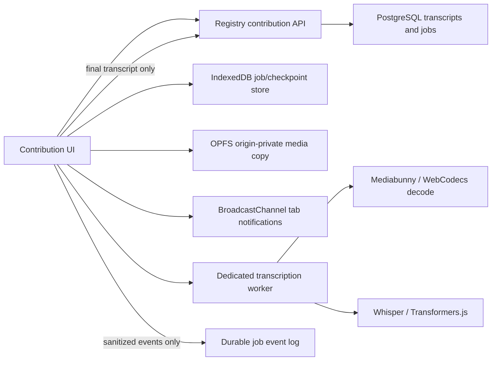
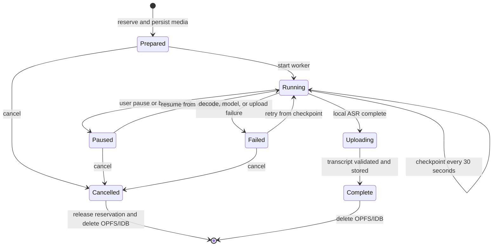
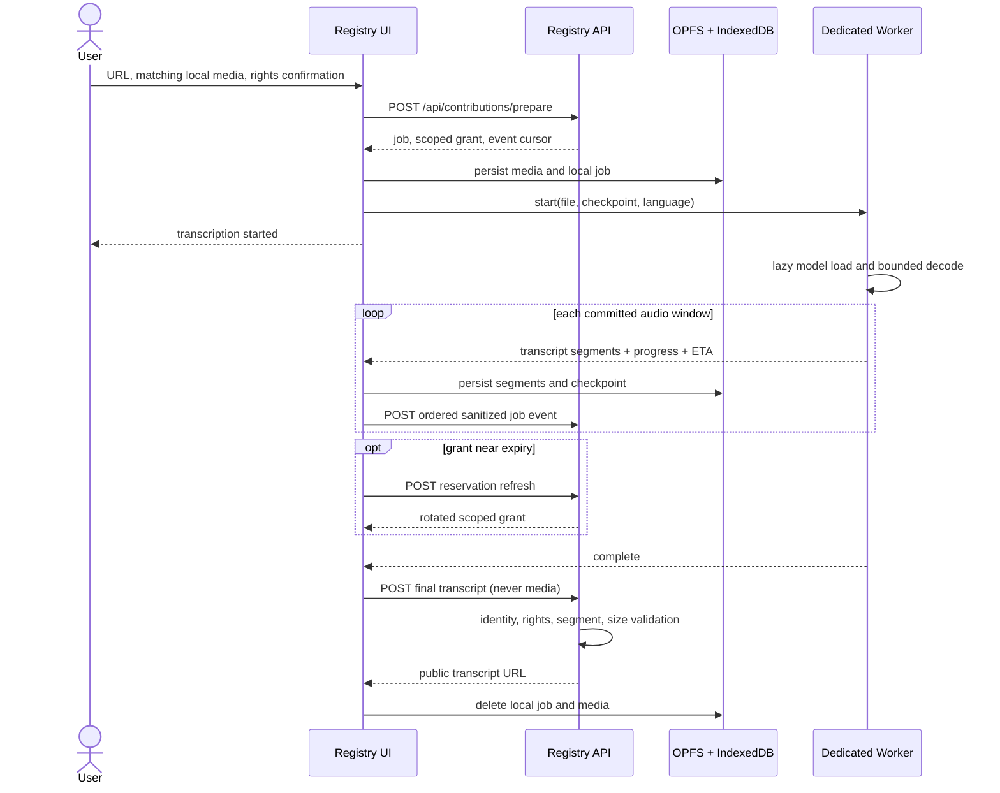

# RFC: asynchronous browser-local transcription

Status: implemented foundation

Owners: Transcript Registry
Scope: permissioned transcription contributions for public YouTube records

## Decision

Registry accepts a YouTube job reservation, but the selected media is copied
only into the browser origin's private file system. A dedicated module worker
decodes bounded audio windows with Mediabunny and transcribes them with
Transformers.js Whisper. IndexedDB stores job metadata and timestamped
transcript checkpoints. Registry receives sanitized progress events and, only
after local completion, the validated transcript through its existing
contribution endpoint.

This extends the existing Registry/Commons boundary instead of replacing it:

- Registry remains the durable public transcript and job authority.
- `transcript-commons` and `/contribute.txt` remain native caption/ASR worker
  paths for unsupported browsers and faster native runtimes.
- The browser path does not become a private-media hosting service. A
  contribution is always bound to one public YouTube video and requires an
  explicit publication-rights confirmation.

## Component design



Browser components:

1. `BrowserContribution` owns user consent, reservation, worker lifecycle,
   progress display, cancellation, and automatic completion upload.
2. `local-job-store` stores resumable state in IndexedDB and media in OPFS.
3. `transcription.worker` lazily loads decoding and ASR dependencies, keeping
   model memory and CPU/GPU work off the main thread.
4. `BroadcastChannel` sends sanitized local status to another open Registry
   tab. It is an optimization, not a source of truth.
5. Registry's `jobs` row is the public summary; `job_events` is the ordered,
   idempotent event history.

## Lifecycle and state



An active compute worker is intentionally not treated as durable. Browsers can
discard tabs and workers at any time. Durability comes from committed
30-second transcript boundaries and a locally persisted media source.

## Sequence



## Message and event contracts

Worker messages are local structured-clone messages:

```ts
type WorkerMessage =
  | { type: "stage"; stage: string; backend?: "webgpu" | "wasm" }
  | { type: "segment"; segment: { start: number; end: number; text: string } }
  | {
      type: "progress";
      processedSeconds: number;
      totalSeconds: number;
      etaSeconds: number | null;
      progressPercent: number;
    }
  | { type: "checkpoint"; processedSeconds: number; totalSeconds: number }
  | { type: "complete"; processedSeconds: number; totalSeconds: number }
  | { type: "error"; error: string };
```

Registry events are smaller and must never contain media, transcript text,
filesystem handles, filenames, or model tensors:

```ts
POST /api/contributions/:jobId/events
Authorization: Bearer <job-scoped-grant>

{
  "id": "client-generated-idempotency-key",
  "sequence": 17,
  "type": "job.checkpointed",
  "payload": {
    "stage": "transcribing",
    "progressPercent": 42,
    "processedSeconds": 1260,
    "totalSeconds": 3000,
    "etaSeconds": 940,
    "backend": "webgpu"
  }
}
```

The `(job_id, sequence)` uniqueness constraint makes retries idempotent. The
prepare response returns `eventCursor`, allowing a replacement contributor to
continue the monotonic sequence. Public consumers can incrementally poll
`GET /api/jobs/:jobId/events?after=16`; the job summary also exposes current
progress without replaying events.

ETA is based on observed wall-clock seconds per committed audio second:

```text
ETA = remaining_audio_seconds × elapsed_wall_seconds / processed_audio_seconds
```

It is recomputed only at commit boundaries to avoid unstable UI updates.

## Local storage and resume

IndexedDB stores the scoped grant, expiry, endpoints, progress, backend,
language, segments, and last committed media timestamp. OPFS stores one
origin-private copy named by the opaque job ID. Neither is readable by
Registry's server.

On page load, any `running` or `uploading` local record is conservatively
changed to `paused`. Resume loads the OPFS file and starts decoding at the last
complete checkpoint. At most one chunk is reprocessed. Completed and cancelled
jobs delete both stores.

The 12-hour contribution grant is rotated before expiry by an authenticated
refresh endpoint. Rotation atomically changes the job reservation owner.
Abandoned reservations become reclaimable after 12 hours.

## Failure and retry policy

| Failure | Handling |
| --- | --- |
| WebGPU model initialization | Retry once with WASM |
| Unsupported container/codec | Preserve job; offer retry or native helper |
| Worker/tab termination | Recover as paused from last checkpoint |
| Progress event network error | Continue local ASR; retry future events |
| Expiring grant | Rotate 30 minutes before expiry |
| Final upload failure | Preserve transcript and media; retry from local job |
| User cancellation | Stop worker, emit cancel, release reservation, delete local data |
| Browser storage eviction | Report unrecoverable local source loss; release or reselect |

Progress is best-effort telemetry. Failure to report progress never blocks
local transcription. The final contribution remains authoritative and uses the
existing strict size, identity, rights, ordering, and transcript/segment
consistency checks.

## Security and privacy

- Grants are HMAC-authenticated, expire, and are scoped to one job/video.
- Reservation rotation prevents an old grant from continuing after refresh.
- Only the active reservation may append events, release, or complete the job.
- Event types and numeric ranges are allowlisted server-side. Unknown payload
  fields, including transcript content, are discarded.
- Worker dependencies are loaded only on the contribution route and execute in
  a dedicated worker. They do not receive Registry credentials other than
  local messages; the UI performs authenticated network calls.
- Media uses `BlobSource`, which reads bounded ranges rather than loading a
  multi-hour file into memory.
- The final server verifies the public YouTube identity. It cannot
  cryptographically prove that a user-selected local recording matches the
  YouTube video; this remains a contribution-trust and moderation concern.
- OPFS is origin-private, not an application-level encryption boundary. A
  compromised Registry origin or browser profile can access it. A strict CSP,
  dependency review, and short retention are required before production
  rollout.

Recommended production hardening includes a separate worker asset origin,
subresource/version pinning, COOP/COEP where SharedArrayBuffer optimizations
are enabled, CSP restrictions for model hosts, transcript abuse detection,
content provenance checks where available, storage quotas, and a visible
"delete local data" control.

## Browser API assessment

| Technology | Role | Sufficient? |
| --- | --- | --- |
| Dedicated Web Worker | ASR and decode off main thread | Yes |
| WASM | Universal inference fallback | Yes, slower |
| WebGPU | Accelerated inference | Yes where available; feature-detect |
| WebNN | Potential inference backend | Not required; availability remains uneven |
| WebCodecs | Efficient audio decode through Mediabunny | Good, codec/browser dependent |
| OPFS | Resumable origin-private media | Yes in current evergreen browsers |
| IndexedDB | Durable metadata/checkpoints | Yes |
| Streams API | Bounded file copying and decode input | Yes |
| BroadcastChannel | Cross-tab status | Yes, optional |
| SharedWorker | Share model across tabs | Possible, but weaker availability/lifecycle |
| Service Worker | Network/event mediation | Not a reliable long-running compute host |

Remaining browser limitations:

- no guarantee that a background tab, worker, or service worker remains alive;
- GPU memory limits and device-loss behavior vary significantly;
- model downloads and browser storage quotas can be large or evicted;
- codec coverage is platform dependent;
- no portable browser API provides a reliable multi-hour daemon, OS-level job
  scheduler, or completion wakeup after the browser is closed;
- iOS and battery/thermal policies can suspend compute aggressively;
- automatic conversational follow-up requires the ChatGPT host, not merely
  this Registry site, to subscribe to completion events.

## ChatGPT tool-orchestration proposal

ChatGPT Web needs a first-class asynchronous local-tool result rather than a
single request/response tool call:

This proposal deliberately mirrors existing OpenAI primitives without claiming
that they already coordinate browser-local jobs. The Responses API's
[background mode](https://developers.openai.com/api/docs/guides/background)
already defines immediate asynchronous creation, status polling, idempotent
cancellation, and resumable event streaming with sequence-number cursors—but
for server-side model responses. The
[Conversations API](https://developers.openai.com/api/docs/guides/conversation-state#using-the-conversations-api)
provides a durable conversation ID across sessions, devices, or jobs and can
store tool calls and tool outputs. OpenAI's current
[tool model](https://developers.openai.com/api/docs/guides/tools) supports
function and remote MCP calls, but does not document a browser-originated
completion callback that autonomously schedules a later ChatGPT turn. The
missing primitive is therefore host orchestration between these concepts, not
another transcription engine.

```ts
type LocalJobHandle = {
  jobId: string;
  capability: "local.transcription";
  state: "accepted" | "running" | "paused" | "complete" | "failed" | "cancelled";
  subscribeUrl?: string;
  pollUrl: string;
  cancelToken: string;
  conversationContinuationId: string;
};
```

Proposed calls:

```text
local.transcription.create(fileHandle, options) -> LocalJobHandle
local.jobs.subscribe(jobId, cursor) -> event stream
local.jobs.status(jobId, cursor) -> events + next cursor
local.jobs.cancel(jobId) -> terminal acknowledgement
local.transcription.readChunks(jobId, afterChunk) -> transcript chunks
conversation.continue(continuationId, localJobResult) -> new assistant turn
```

Creation returns immediately, allowing the assistant to say that transcription
started. Event subscription is preferred while the page is active; cursor
polling is the recovery path after reconnect. Transcript chunks carry stable
IDs and commit markers so tool retries do not duplicate context.

On terminal completion, the browser orchestration layer—not the model—attaches
the result to the original durable conversation and schedules a new assistant
turn. `conversationContinuationId` is a proposed host-level binding, not a
currently documented API field. The turn receives a compact tool result plus
chunk references, not the entire transcript unless context budgeting selects
it. User messages sent while the job runs remain normal conversation turns.
The follow-up turn must merge against the latest conversation head and clearly
identify which local job completed, preventing reasoning from resuming against
a stale branch.

This requires host-level durable continuation metadata and authenticated
browser event delivery. Existing web workers, storage, and streams are enough
for local transcription, but they cannot by themselves wake ChatGPT, create a
new model turn, or guarantee background execution after the browser closes.

## Alternatives

| Architecture | Advantages | Costs / reasons not selected |
| --- | --- | --- |
| Upload media to hosted ASR | Uniform hardware, durable execution | Raw media leaves device; bandwidth and infrastructure cost |
| Native Commons/CLI worker | Fast native runtimes, true OS process | Installation and agent/terminal coordination; retained as fallback |
| Browser dedicated worker (chosen) | No install, no media upload, responsive UI | Tab lifecycle, model/storage size, device variance |
| SharedWorker model host | Reuse one model across tabs | Lifecycle and browser support are not strong enough as sole owner |
| Service Worker compute | Survives navigation in some cases | Browser may terminate it; designed for short event work |
| Extension/native messaging | Reliable local process and filesystem access | Installation, elevated trust, store distribution |
| Local companion daemon | Best durability and performance | Security surface and setup burden; overlaps Commons |

## Rollout and observability

Ship behind capability detection and a feature flag. Track only aggregate,
content-free metrics: prepare success, supported decoder/backend, checkpoint
latency, real-time factor, model-load failure, resume rate, cancellation, final
validation failure, and storage eviction. Never log filenames, transcript
chunks, source media, local paths, or model inputs.

Initial success criteria:

- zero media requests observed at Registry endpoints;
- main-thread responsiveness during ASR;
- bounded memory for multi-hour media;
- successful resume within one 30-second replay window;
- idempotent event recovery after network interruption;
- automatic final contribution with the existing validator;
- native helper remains available when browser capabilities are insufficient.
